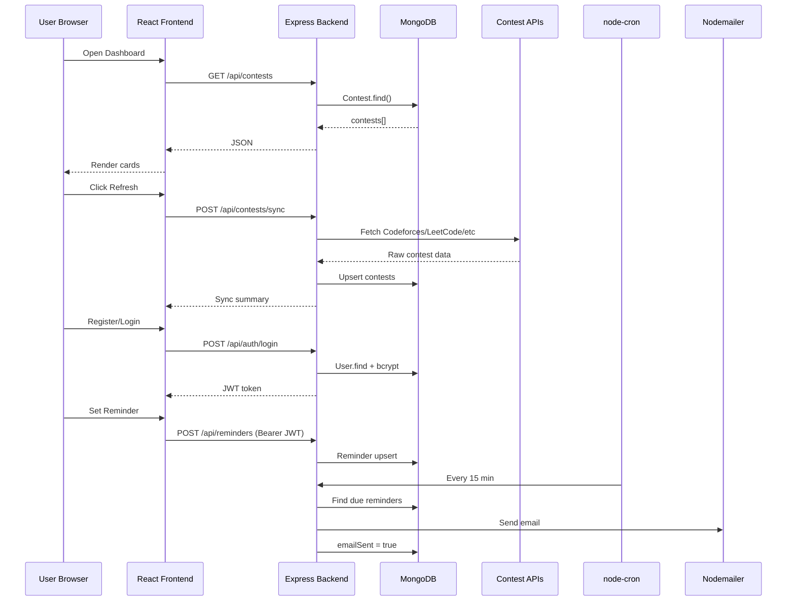

# CodePing – Architecture, Flow & Learning Guide

This document explains **how CodePing works end-to-end**: which file calls which file, why decisions were made, and what to study to understand the project deeply.

---

## 1. High-Level System Overview

CodePing is a **MERN stack** application with **two independent processes**:

```
┌─────────────────────────┐         ┌─────────────────────────┐
│   PROCESS 1: Frontend   │  HTTP   │   PROCESS 2: Backend    │
│   React + Vite (:5173)  │ ──────► │   Express API (:5000)   │
│                         │         │   + CRON Jobs           │
│   - Dashboard UI        │         │   + Email Service       │
│   - Auth (JWT in LS)    │         │                         │
└─────────────────────────┘         └───────────┬─────────────┘
                                                │
                    ┌───────────────────────────┼───────────────────────────┐
                    ▼                           ▼                           ▼
              MongoDB Atlas/Local        External Contest APIs          SMTP (Gmail)
              (Users, Contests,         Codeforces, LeetCode,          Email reminders
               Reminders)               CodeChef, AtCoder
```

**Why 2 processes?**

- Frontend and backend are **separated** (standard MERN pattern).
- Backend runs **background CRON jobs** (contest sync + email) even when no user is on the website.
- Frontend can be deployed to Vercel/Netlify; backend to Render/Railway.

---

## 2. Tech Stack (Mapped to Resume)

| Layer | Technology | Resume Alignment |
|-------|------------|------------------|
| Frontend | React, HTML5, CSS3, JavaScript | Frontend skills |
| Backend | Node.js, Express, REST APIs | REST APIs, Microservices fundamentals |
| Database | MongoDB, Mongoose ODM | MongoDB in resume |
| Auth | JWT + bcrypt | Security basics, OOP |
| Scheduling | node-cron | Automation (90% manual tracking reduction claim) |
| Email | Nodemailer | Email reminders feature |
| HTTP Client | Axios | External API integration |
| Build Tool | Vite | Modern React tooling |

---

## 3. Backend File-by-File Flow

### 3.1 Entry Point: `backend/server.js`

**Startup sequence:**

```
server.js
  ├── dotenv.config()           → Load .env variables
  ├── connectDB()               → config/db.js → MongoDB
  ├── syncAllContests()         → First fetch on startup
  ├── startCronJobs()           → Schedule recurring tasks
  └── app.listen(5000)          → Start Express server
```

**Routes mounted:**

| Path | File | Purpose |
|------|------|---------|
| `/api/auth` | `routes/auth.js` | Register, Login |
| `/api/contests` | `routes/contests.js` | List, Sync contests |
| `/api/reminders` | `routes/reminders.js` | CRUD reminders (protected) |

**Condition:** If MongoDB is unreachable → server exits with error (fail-fast).

---

### 3.2 Database Layer

#### `config/db.js`

- Reads `MONGODB_URI` from environment.
- Connects via Mongoose.
- **Why Mongoose?** Schema validation, indexes, middleware (password hashing).

#### Models

| Model | File | Key Fields | Indexes |
|-------|------|------------|---------|
| User | `models/User.js` | name, email, password, favoritePlatforms | email unique |
| Contest | `models/Contest.js` | platform, externalId, name, url, startTime, status | platform+externalId unique |
| Reminder | `models/Reminder.js` | user, contest, remindBeforeMinutes, emailSent | user+contest unique |

**User password flow:**

```
POST /api/auth/register
  → User.create()
  → pre('save') hook in User.js
  → bcrypt.hash(password, 10)
  → stored hashed (never plain text)
```

---

### 3.3 Contest Aggregation Pipeline

**Main orchestrator:** `services/contestAggregator.js`

```
syncAllContests()
  │
  ├── fetchCodeforcesContests()   → services/contestFetchers/codeforces.js
  ├── fetchLeetCodeContests()     → services/contestFetchers/leetcode.js
  ├── fetchCodeChefContests()     → services/contestFetchers/codechef.js
  └── fetchAtCoderContests()      → services/contestFetchers/atcoder.js
          │
          ▼
  upsertContests() → Contest.findOneAndUpdate({ platform, externalId }, data, { upsert: true })
          │
          ▼
  Mark expired contests as 'finished'
```

**Why upsert?** Same contest fetched multiple times updates in place — no duplicates.

**External APIs used:**

| Platform | API URL | Why this API |
|----------|---------|--------------|
| Codeforces | `https://codeforces.com/api/contest.list` | Official public REST API |
| LeetCode | `POST https://leetcode.com/graphql` (`upcomingContests` query) | Public GraphQL — old REST endpoint returns 403 |
| CodeChef | `https://www.codechef.com/api/list/contests/all` | Official contest list API |
| AtCoder | `https://kenkoooo.com/atcoder/resources/contests.json` | Reliable third-party JSON (AtCoder has no simple public API) |

**Error handling condition:**

- If **one platform fails** (timeout, API down), others still sync.
- Errors collected in `summary.errors` — partial success is acceptable.

**Status logic:**

```
if contest.endTime < now        → status = 'finished'
if now between start and end    → status = 'running'
else                            → status = 'upcoming'
```

---

### 3.4 CRON Jobs: `jobs/cronJobs.js`

Two scheduled tasks:

#### Job 1: Contest Sync (default: every 30 min)

```
CRON trigger
  → syncAllContests()
  → Updates MongoDB with fresh contest data
```

**Why?** Platform APIs change; contests get added/cancelled. Keeps DB fresh without user clicking "Refresh".

#### Job 2: Reminder Emails (default: every 15 min)

```
CRON trigger
  → processDueReminders()
  → Find Reminder where emailSent = false
  → For each reminder:
       remindAt = contest.startTime - remindBeforeMinutes
       IF now >= remindAt AND now < startTime:
         → sendReminderEmail() via Nodemailer
         → Set emailSent = true, sentAt = now
       IF contest.status = 'finished':
         → Mark emailSent = true (skip)
```

**Why 15-minute CRON?** Balance between timely emails and server load. Reminder window is checked each run.

**Email skip condition:** If `EMAIL_USER` or `EMAIL_PASS` not set → logs skip, app continues.

---

### 3.5 Authentication Flow

```
Register/Login (routes/auth.js)
  → Validate input
  → bcrypt compare (login) or hash (register via model hook)
  → jwt.sign({ id, email }, JWT_SECRET, { expiresIn: '7d' })
  → Return { token, user }

Protected routes (routes/reminders.js)
  → middleware/auth.js
  → Read Authorization: Bearer <token>
  → jwt.verify()
  → Attach req.user = { id, email }
  → next()
```

**Why JWT?** Stateless auth — no session store needed. Frontend stores token in `localStorage`.

---

### 3.6 API Request Flow Examples

#### Example A: User opens Dashboard

```
Browser → GET /api/contests?platform=codeforces
  → routes/contests.js
  → contestAggregator.getContests({ platform: 'codeforces' })
  → Contest.find({ platform, status: { $in: ['upcoming','running'] } })
  → JSON response → React renders ContestCard components
```

#### Example B: User sets reminder

```
Browser → POST /api/reminders  { contestId, remindBeforeMinutes: 60 }
  → auth middleware (JWT required)
  → Find contest by ID
  → IF contest.status === 'finished' → 400 error
  → Reminder.findOneAndUpdate (upsert)
  → CRON will send email when time window matches
```

---

## 4. Frontend File-by-File Flow

### 4.1 Bootstrap

```
index.html
  → main.jsx
      → BrowserRouter
      → AuthProvider (context/AuthContext.jsx)
      → App.jsx (routes)
```

### 4.2 Routing: `src/App.jsx`

| Route | Component | Auth |
|-------|-----------|------|
| `/` | Dashboard | Public |
| `/login` | Login | Public |
| `/register` | Register | Public |
| `/reminders` | Reminders | Protected (redirect to /login) |

**ProtectedRoute condition:** `isAuthenticated === false` → `<Navigate to="/login" />`

### 4.3 State Management

**AuthContext** stores:
- `token` → localStorage `codeping_token`
- `user` → localStorage `codeping_user`

**Why Context API?** Small app — Redux would be over-engineering.

### 4.4 API Layer: `src/services/api.js`

All HTTP calls go through one module:

```
api.getContests()
  → fetch(VITE_API_URL + '/contests')
  → Adds Authorization header if token exists
  → Throws Error if response not ok
```

**Why centralize?** Single place for base URL, headers, error handling.

### 4.5 Dashboard User Journey

```
Dashboard.jsx (mount)
  → api.getContests()
  → setContests(data.contests)

User clicks "Refresh Contests"
  → api.syncContests()  → POST /api/contests/sync
  → api.getContests()   → reload UI

User clicks "Set Reminder"
  → IF not logged in → show error
  → api.createReminder({ contestId })
  → show success message
```

---

## 5. Data Flow Diagram (Complete)



---

## 6. Environment Variables – Why Each Exists

| Variable | Used In | Purpose |
|----------|---------|---------|
| `PORT` | server.js | Backend listen port |
| `MONGODB_URI` | config/db.js | Database connection |
| `JWT_SECRET` | auth routes, middleware | Sign/verify tokens |
| `CLIENT_URL` | server.js (CORS), emailService | Allow frontend origin |
| `EMAIL_*` | config/email.js, emailService | SMTP configuration |
| `CONTEST_FETCH_CRON` | cronJobs.js | Sync schedule |
| `REMINDER_CRON` | cronJobs.js | Email check schedule |
| `VITE_API_URL` | frontend api.js | Backend base URL |

---

## 7. Topics to Learn From This Project

Study these in order for maximum understanding:

### Beginner

1. **HTTP & REST** – GET/POST, status codes, JSON
2. **JavaScript async/await** – How fetch/axios work
3. **React components & props** – UI building blocks
4. **MongoDB basics** – Collections, documents, queries

### Intermediate

5. **Express routing & middleware** – Request pipeline
6. **Mongoose schemas & indexes** – Data modeling
7. **JWT authentication** – Stateless auth pattern
8. **bcrypt password hashing** – Security fundamentals
9. **React Context API** – Global state without Redux
10. **React Router** – SPA navigation, protected routes
11. **CORS** – Why browser blocks cross-origin requests

### Advanced

12. **CRON scheduling** – Background jobs in Node.js
13. **Third-party API integration** – Parsing heterogeneous data formats
14. **Upsert patterns** – Idempotent data sync
15. **Nodemailer & SMTP** – Transactional email
16. **Environment-based configuration** – 12-factor app principles
17. **Separation of concerns** – routes / services / models layers
18. **Error isolation** – Partial failure in multi-source aggregation

### System Design (Interview Prep)

19. **Why cache contests in DB** instead of calling APIs on every page load?
    - Faster response, rate-limit protection, works if one API is slow.
20. **Why CRON instead of real-time websockets?**
    - Contest schedules are known in advance; polling every 15 min is sufficient.
21. **How would you scale?**
    - Separate CRON worker process, Redis queue for emails, CDN for frontend.

---

## 8. File Reference Map

```
backend/
├── server.js                          # App entry, bootstrap
├── config/
│   ├── db.js                          # MongoDB connection
│   └── email.js                       # Nodemailer transporter
├── models/
│   ├── User.js                        # User schema + password hash
│   ├── Contest.js                     # Contest schema + indexes
│   └── Reminder.js                    # Reminder schema
├── routes/
│   ├── auth.js                        # /register, /login
│   ├── contests.js                    # /contests, /sync
│   └── reminders.js                   # Protected reminder CRUD
├── middleware/
│   └── auth.js                        # JWT verification
├── services/
│   ├── contestAggregator.js           # Sync orchestration
│   ├── emailService.js                # Send reminder emails
│   └── contestFetchers/
│       ├── codeforces.js
│       ├── leetcode.js
│       ├── codechef.js
│       └── atcoder.js
├── jobs/
│   └── cronJobs.js                    # Scheduled sync + reminders
└── scripts/
    ├── seedDemoUser.js                # Demo account
    └── seedContests.js                # Manual sync script

frontend/
├── index.html
├── vite.config.js                     # Dev server + API proxy
└── src/
    ├── main.jsx                       # React bootstrap
    ├── App.jsx                        # Routes
    ├── context/AuthContext.jsx        # Auth state
    ├── services/api.js                # HTTP client
    ├── components/
    │   ├── Layout.jsx                 # Navbar + shell
    │   └── ContestCard.jsx            # Contest display
    └── pages/
        ├── Dashboard.jsx              # Main contest list
        ├── Login.jsx
        ├── Register.jsx
        └── Reminders.jsx              # User reminders
```

---

## 9. Conditions & Business Rules Summary

| Condition | Where | Action |
|-----------|-------|--------|
| Password < 6 chars | auth.js | 400 Bad Request |
| Email already exists | auth.js | 409 Conflict |
| No JWT on protected route | auth.js middleware | 401 Unauthorized |
| Contest finished | reminders.js | Cannot create reminder |
| Email not configured | emailService.js | Skip send, log message |
| Platform API fails | contestAggregator.js | Continue other platforms |
| Reminder time window passed | cronJobs.js | No email sent |
| Contest already started | cronJobs.js | Email only if now < startTime |

---

## 10. Resume Bullet Mapping

| Resume Claim | Implementation |
|--------------|----------------|
| MERN full-stack app | MongoDB + Express + React + Node |
| Aggregates Codeforces, LeetCode, CodeChef, AtCoder | 4 fetcher modules + aggregator |
| REST API integrations | Axios calls to public platform APIs |
| NodeMailer email reminders | services/emailService.js |
| CRON scheduling | jobs/cronJobs.js |
| Responsive dashboards | CSS grid/flex, mobile breakpoints |
| 90% manual tracking reduction | Automated sync + email reminders |

---

## 11. Suggested Demo Script (For Interviews)

1. Show dashboard with contests from 4 platforms.
2. Explain sync pipeline (API → normalize → MongoDB upsert).
3. Register, set reminder, show document in MongoDB.
4. Explain CRON: "Every 15 minutes, checks if startTime - 60min <= now".
5. Show ARCHITECTURE.md and discuss scaling options.

---

*This project demonstrates full-stack MERN development, external API integration, scheduled automation, and user-centric features aligned with Parshant Garg's resume and industry experience at FNZ (.NET/SQL) and Expedia (Spring Boot microservices).*
